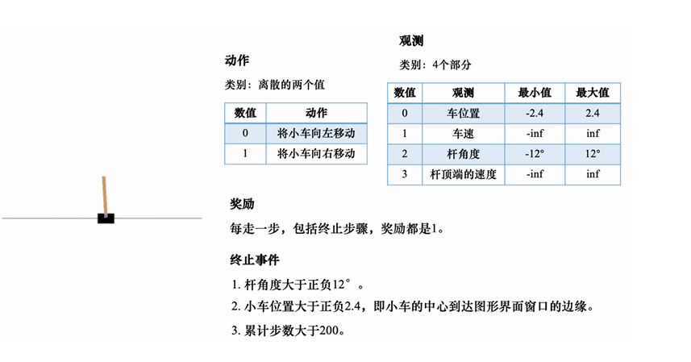

# 强化学习入门

### 主流环境分类：
- 经典控制环境 ：
1. CartPole-v1 - 倒立摆平衡问题
2. MountainCar-v0 - 山地车爬坡（离散动作）
3. MountainCarContinuous-v0 - 山地车爬坡（连续动作）
4. Acrobot-v1 - 双连杆摆问题
5. Pendulum-v1 - 单摆控制问题
- 其他热门环境 ：
1. LunarLander-v3 - 月球着陆器
2. BipedalWalker-v3 - 双足步行机器人
3. CarRacing-v3 - 赛车环境

### Gym的经典环境：
1. 经典控制 Classic Control:
  - Acrobot-v1：双摆杆倒立摆问题。
  - CartPole-v1：杆车平衡问题。
  - MountainCar-v0：小车爬山问题。
  - Pendulum-v0：摆杆倒立问题。
  - MountainCarContinuous-v0：连续动作的小车爬山问题。
2. Box2D:
  - LunarLander-v2：着陆舱着陆问题。
  - LunarLanderContinuous-v2：连续动作的着陆舱着陆问题。
  - BipedalWalker-v3：双足行走机器人问题。
  - BipedalWalkerHardcore-v3：更困难版本的双足行走机器人问题。
  - CarRacing-v0：赛车游戏。
3. Atari:
  - Pong-v0：乒乓球游戏 Pong。
  - Breakout-v0：打砖块游戏 Breakout。
  - SpaceInvaders-v0：太空侵略者游戏 Space Invaders。
  - MsPacman-v0：吃豆人游戏 Ms. Pacman。
  - Enduro-v0：汽车竞赛游戏 Enduro。
  - BeamRider-v0：射击游戏 Beam Rider。
4. MuJoCo:
  - HalfCheetah-v3：半身豹机器人问题。
  - Hopper-v3：单腿机器人问题。
  - Walker2d-v3：双足行走机器人问题。
  - Ant-v3：蚂蚁机器人问题。
  - Humanoid-v3：人形机器人问题。
  - HumanoidStandup-v2：人形机器人站立问题。